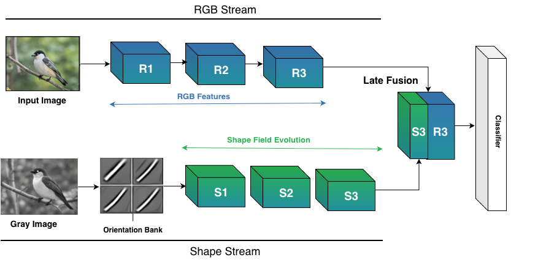

# Shape-ResNet: Injecting Explicit Shape Bias into CNNs for Corruption Robustness without Data Augmentation

Shape-ResNet is a dual-stream convolutional architecture that explicitly
encodes shape and structural information alongside standard RGB features.
A fixed orientation bank extracts edge responses across 16 orientations,
and a learnable diffusion encoder propagates these into multi-scale shape
representations. The shape stream is fused with the RGB backbone at the
deepest stage via late concatenation fusion. All models are trained
exclusively on clean data — no corruption augmentation, stylization, or
adversarial training of any kind. Shape-ResNet consistently improves
mean Corruption Accuracy (mCA) on CIFAR-10-C and CIFAR-100-C while
maintaining competitive clean accuracy, demonstrating that architectural
shape bias alone is a reliable inductive prior for out-of-distribution
robustness.

---

## Architecture



The RGB stream (ResNet-18 or ResNet-50, layers 1–3 only) and the shape
stream (orientation bank → ShapeDiffusion encoder) run in parallel. Their
outputs are concatenated at stage 3 and passed through a lightweight fusion
block before global average pooling and classification.

---

## Setup

```bash
pip install -r requirements.txt
```

Place datasets under `./data/`:
- `CIFAR-10` and `CIFAR-10-C`
- `CIFAR-100` and `CIFAR-100-C`

CIFAR-10/100 are downloaded automatically on first run. CIFAR-10-C and
CIFAR-100-C must be downloaded manually from
https://zenodo.org/record/2535967.

---

## Training

### Individual models

```bash
# Baseline ResNet-18 on CIFAR-10
python train.py --model baseline_res18 --dataset cifar10

# Shape-ResNet-18 on CIFAR-10
python train.py --model shape_res18 --dataset cifar10

# Baseline ResNet-50 on CIFAR-100
python train.py --model baseline_res50 --dataset cifar100

# Shape-ResNet-50 on CIFAR-100
python train.py --model shape_res50 --dataset cifar100
```

All optional flags (defaults shown):
```bash
python train.py \
  --model    shape_res18 \
  --dataset  cifar10 \
  --data_dir ./data \
  --ckpt_dir ./checkpoints \
  --epochs   40 \
  --batch    128 \
  --lr       0.1 \
  --seed     42
```

### Model groups

```bash
# All 4 main models on CIFAR-10
python train.py --run_group cifar_all --dataset cifar10

# All 4 main models on CIFAR-100
python train.py --run_group cifar_all --dataset cifar100

# Ablation variants (ResNet-18 / CIFAR-10 only)
python train.py --run_group ablation_cifar10 --dataset cifar10
```

Available groups: `cifar_all`, `ablation_cifar10`, `imagenet_core`,
`imagenet_all`, `imagenet100_core`, `imagenet100_all`.

### All models at once

```bash
python train.py --run_all --dataset cifar10
python train.py --run_all --dataset cifar100
```

---

## Evaluation

### Individual model

```bash
python eval.py --model shape_res18 --dataset cifar10 \
  --ckpt checkpoints/shape_res18_cifar10.pt

python eval.py --model baseline_res18 --dataset cifar100 \
  --ckpt checkpoints/baseline_res18_cifar100.pt
```

### Eval groups

```bash
# All 4 main models on CIFAR-10
python eval.py --eval_group cifar_all --dataset cifar10

# Ablation variants
python eval.py --eval_group ablation_cifar10 --dataset cifar10
```

### All models

```bash
python eval.py --eval_all --dataset cifar10
python eval.py --eval_all --dataset cifar100
```

---

## Ablation Study

Train all 7 ablation variants (gating and fusion strategies) on CIFAR-10:

```bash
python train.py --run_group ablation_cifar10 --dataset cifar10 \
  --ckpt_dir ./checkpoints/ablation

python eval.py --eval_group ablation_cifar10 --dataset cifar10 \
  --ckpt_dir ./checkpoints/ablation \
  --results_dir ./results/ablation
```

Ablation variants:
| Model | Description |
|-------|-------------|
| `shape_res18_early_gate` | Gate r1, r2 + late fusion |
| `shape_res18_late_gate` | Gate r3 + late fusion |
| `shape_res18_gate_only` | Gate r3, no fusion |
| `shape_res18_early_gate_nofuse` | Gate r1, r2, no fusion |
| `shape_res18_early_fuse` | Inject s2 at r2, no gate |
| `shape_res18_early_fuse_early_gate` | Early fusion + early gate |
| `shape_res18_early_fuse_late_gate` | Early fusion + late gate |

---

## Profiling

Measure parameter count, GFLOPs, latency, throughput, and peak GPU memory:

```bash
# All CIFAR models
python profiler.py --dataset cifar10

# Specific models
python profiler.py --dataset cifar10 \
  --models baseline_res18,shape_res18,baseline_res50,shape_res50
```

---

## Results and Table Generation

After running sweeps, parse results and generate LaTeX tables and figures:

```bash
# 1. Parse JSON results to CSV
python parse_results.py \
  --results_dir results/cifar-sweep \
  --out_dir csvs

# 2. Compute mean ± std across seeds
python make_stats_csv.py \
  --summary_csv csvs/summary.csv \
  --out csvs/summary_stats.csv

# 3. Main clean/mCA/mCE table
python make_main_table.py \
  --stats_csv csvs/summary_stats.csv \
  --out tables/main_table.tex

# 4. Per-corruption tables (CIFAR-10-C and CIFAR-100-C)
python make_corruption_table.py \
  --corr_csv csvs/per_corruption.csv \
  --out_dir tables

# 5. Severity figures
python make_plots.py \
  --corr_csv csvs/per_corruption.csv \
  --out_dir figures

# 6. Efficiency table
python make_efficiency_table.py \
  --profile_dir results/profile \
  --out_dir tables

# 7. Ablation table
python make_ablation_table.py \
  --results_dir results/ablation-sweep \
  --out_dir tables \
  --csv_dir csvs
```

---

## Kubernetes (Cluster) Usage

All jobs require a Persistent Volume Claim (PVC) mounted at `/pvc` with
the following layout:

```
/pvc/
├── cifar10/          CIFAR-10 + CIFAR-10-C
├── cifar100/         CIFAR-100 + CIFAR-100-C
├── checkpoints/      saved model checkpoints
└── results/          evaluation results
```

Before submitting any job, update the placeholders in the YAML files:

| Placeholder | Replace with |
|-------------|-------------|
| `<YOUR_NAMESPACE>` | your Kubernetes namespace |
| `<YOUR_PVC_NAME>` | your PVC name |
| `<YOUR_USERNAME>` | your GitHub username |
| `<YOUR_PAT_SECRET>` | name of your Kubernetes secret holding the GitHub PAT |

The secret should be created as:
```bash
kubectl create secret generic <YOUR_PAT_SECRET> \
  --from-literal=token=<YOUR_GITHUB_TOKEN> \
  -n <YOUR_NAMESPACE>
```

### CIFAR sweep (main results)

Trains `baseline_res18`, `baseline_res50`, `shape_res18`, `shape_res50`
on CIFAR-10 and CIFAR-100 across 3 seeds (24 runs, ~12 hours).

```bash
kubectl apply -f cifar-sweep-job.yaml -n <YOUR_NAMESPACE>
kubectl logs -f job/shape-cifar-sweep -n <YOUR_NAMESPACE>
```

### Ablation sweep

Trains 7 ablation variants on CIFAR-10 across 3 seeds (21 runs, ~7 hours).

```bash
kubectl apply -f ablation-sweep-job.yaml -n <YOUR_NAMESPACE>
kubectl logs -f job/shape-ablation-sweep -n <YOUR_NAMESPACE>
```

### Profiling

```bash
kubectl apply -f profile-job.yaml -n <YOUR_NAMESPACE>
kubectl logs -f job/shape-resnet-profiler -n <YOUR_NAMESPACE>
```

### Feature visualization

Generates feature map comparison figures for the paper. Requires trained
checkpoints at `/pvc/checkpoints/feature-vis/`.

```bash
kubectl apply -f feature-vis-job.yaml -n <YOUR_NAMESPACE>
kubectl logs -f job/shape-feature-vis -n <YOUR_NAMESPACE>
```

### PVC and data pod

```bash
# Create PVC
kubectl apply -f data-pvc.yaml -n <YOUR_NAMESPACE>

# Interactive pod for data download / inspection
kubectl apply -f data-pod.yaml -n <YOUR_NAMESPACE>
kubectl exec -it shell-pod -n <YOUR_NAMESPACE> -- bash
```

---

## File Structure

All files live at the repository root.

```
# Core
models.py                    model definitions (15 models)
train.py                     training script
eval.py                      corruption robustness evaluation
profiler.py                  FLOPs, latency, memory profiling
visualize_features.py        feature map visualization figures
requirements.txt             dependencies

# Results and tables
parse_results.py             parse sweep JSONs to CSV
make_stats_csv.py            compute mean ± std across seeds
make_main_table.py           LaTeX main results table
make_corruption_table.py     LaTeX per-corruption tables
make_plots.py                severity and per-corruption figures
make_efficiency_table.py     LaTeX efficiency table
make_efficiency_figs.py      efficiency bar-chart figures
make_ablation_table.py       LaTeX ablation table

# Kubernetes jobs
cifar-sweep-job.yaml         CIFAR sweep (main results)
ablation-sweep-job.yaml      ablation sweep
profile-job.yaml             profiling job
feature-vis-job.yaml         visualization job
data-pvc.yaml                PVC definition
data-pod.yaml                interactive data pod
```
